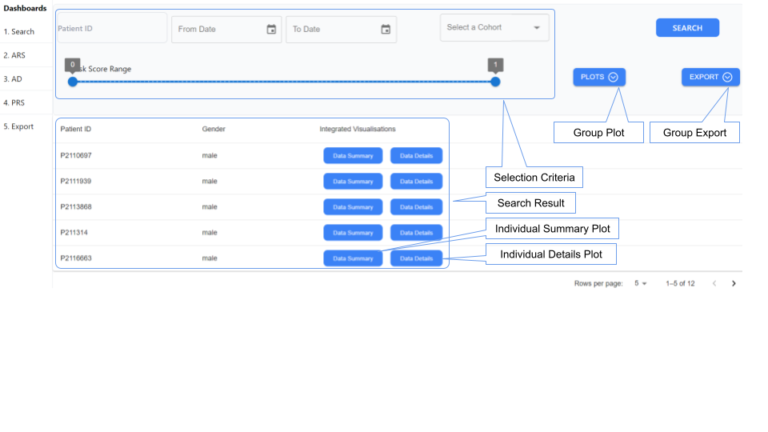

EHR-Int-Viz
===========

To facilitate the utilisation of integrated data representation, we developed several functionalities as part of EHR-Int-Viz module.

1. Search function was developed to facilitate the retrieval of records from a FHIR server based on specified criteria.

2. The resulting records are visualised at individual and group level.

Individual visualisations include;

2. 1. Summary plot offering a high-level overview
2. 2. Detailed plots for much finer granularity

Group-level plots provide visualisations of the integrated data for all records matching the search criteria. These plots are categorised into;

2. 3. AMR summary
2. 4. FASTA summary
2. 5. Token summary

The search results can be exported into flat files for downstream processing.
