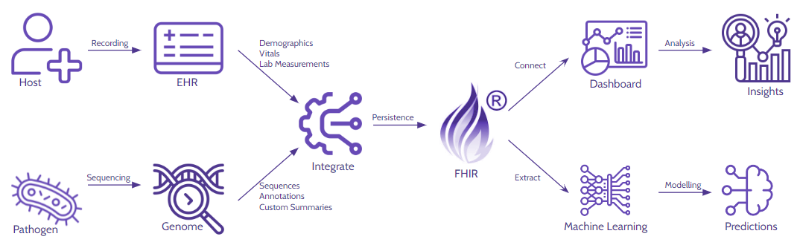
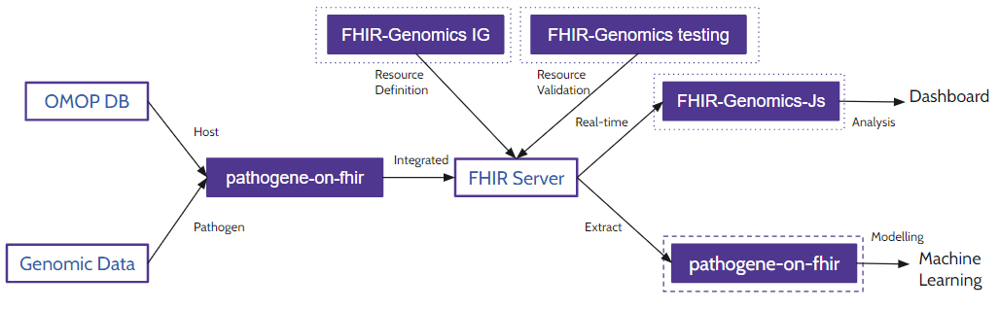

EHR-Int
=======

EHR-Int aims to provide a more comprehensive understanding of disease progression by integrating Electronic Health Record (EHR) data with bacterial genomic sequencing data. This approach considers both the host's response (reflected in EHR data) and the characteristics of the pathogen itself (obtained through genomic sequencing). This integrated analysis has the potential to lead to more accurate and informative models for disease progression.

**High-Level Architecture**

The high-level architecture of EHR-Int is depicted below:

EHR-Int is a modular system, consisting of four independent codebases:

1. **Pathogene on FHIR**: This module focuses on migrating data to FHIR by sourcing it from OMOP-CDM, GTF Files, and other custom files. It can also do the reverse conversion, by reading FHIR resources and persisting it in a standard OMOP-CDM database.
2. **FHIR Genomics IG**: This module defines the Implementation Guide (IG) for an integrated representation of genomic information and the EHR data within the FHIR framework.
3. **FHIR Genomics Test**: This module deals with the representation of validation framework for FHIR resources defined in the IG.
4. **FHIR Genomics JS**: This module builds an interactive dashboard for the integrated data analysis.

**Workflow**

The workflow diagram illustrating the interaction between these modules is depicted in the following image:

.. note::

   This project is under active development.

.. topic:: Acknowledgements

   .. image:: images/monash.png
      :width: 20 %

   .. image:: images/alfred.png
      :width: 20 %

   .. image:: images/superbugai.png
      :width: 20 %

   .. image:: images/RMIT_University_Logo.png
      :width: 20 %

Contents
--------

.. toctree::
   :maxdepth: 1

   pathogene_on_fhir
