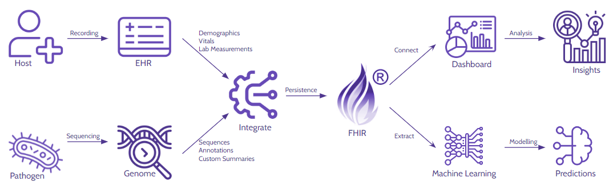
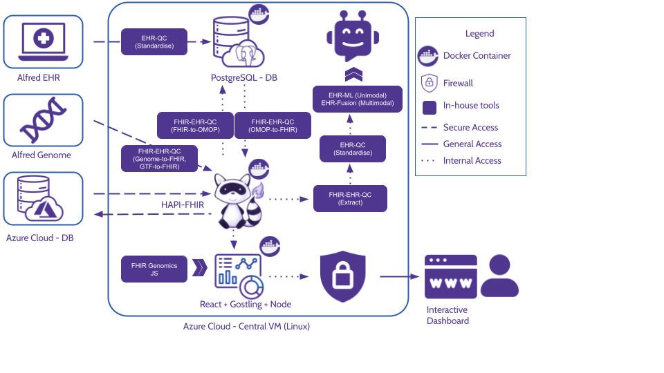

Pathogene-on-FHIR
=================

Pathogene-on-FHIR aims to provide a more comprehensive understanding of disease progression by integrating Electronic Health Record (EHR) data with bacterial genomic sequencing data. This approach considers both the host's response (reflected in EHR data) and the characteristics of the pathogen itself (obtained through genomic sequencing). This integrated analysis has the potential to lead to more accurate and informative models for disease progression.

**High-Level Architecture**

The high-level architecture of Pathogene-on-FHIR is depicted below:

Pathogene-on-FHIR is a modular system, consisting of four independent codebases:

1. **OMOP-to-FHIR**: This module focuses on migrating data to FHIR by sourcing it from relational databases such as OMOP-CDM. It can also do the reverse conversion, by reading FHIR resources and persisting it in a standard OMOP-CDM database.
2. **Genome-to-FHIR**: This module focuses on migrating data to FHIR by sourcing it from GTF files, FASTA files, and other custom files.
3. **EHR-Int-Extract**: This module provides utility functions to extract the data from FHIR including EHR entities, genomic data, and integrated representations.
4. **EHR-Int-Viz**: This module builds an interactive dashboard for the integrated data analytics.

.. note::

   In this documentation, we provide detailed usage information about OMOP-to-FHIR, and Genome-to-FHIR modules. However, this is only a part of Pathogene-on-FHIR framework which consists of other modules.

**Workflow**

The workflow diagram illustrating the interaction between these modules is depicted in the following image:

.. note::

   This project is under active development.

.. topic:: Acknowledgements

   .. image:: images/monash.png
      :width: 20 %

   .. image:: images/alfred.png
      :width: 20 %

   .. image:: images/superbugai.png
      :width: 20 %

   .. image:: images/RMIT_University_Logo.png
      :width: 20 %

Contents
--------

.. toctree::
   :maxdepth: 1

   install_run
   configurations
   fhir_ehr_qc
